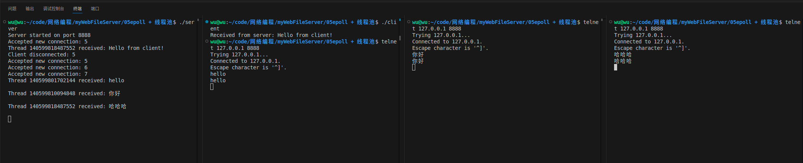

你启动服务端后可以使用
```bash
telnet 127.0.0.1 8888
# 或
nc 127.0.0.1 8888
```



# 原子变量
很好，这是一个关键点！

---

## 🔹什么是 `std::atomic<bool> stop;`

它是一个 **原子变量**，保证在多线程环境下**对变量的读写操作是线程安全的**。

---

## ❗为什么需要原子变量？

在多线程程序中，多个线程可能**同时读取或修改一个变量**，如果不加保护，就会出现：

* 数据竞争（Data Race）
* 未定义行为（Undefined Behavior）

例如，假设多个线程同时这样写：

```cpp
if (!stop) {
    // 执行任务
}
```

如果 `stop` 是普通 `bool` 类型，这段代码的 `if (!stop)` 可能在读取后又被其他线程改变，导致出现不可预测的行为。

---

## ✅ 原子变量的作用

使用 `std::atomic<bool>` 可以确保：

* **读取**是原子的（不会读一半）；
* **写入**是原子的（不会写一半）；
* **多个线程同时读写也不会出错**；
* 不需要手动加锁（效率高）。

---

## 🧠 举个简单例子

```cpp
#include <atomic>
#include <thread>
#include <iostream>

std::atomic<bool> stop(false);

void worker() {
    while (!stop) {
        // do some work...
    }
    std::cout << "Thread exiting\n";
}

int main() {
    std::thread t(worker);  //启动了一个线程，执行上面定义的 worker() 函数。
    std::this_thread::sleep_for(std::chrono::seconds(1));  //主线程休眠 1 秒，让 worker 线程跑一会儿。
    stop = true;  // 安全地让线程退出
    t.join();  //主线程等待 worker 线程结束。如果没有这句，主线程可能提前结束，程序就会直接退出或出错。
}
```
代码整体功能

它启动了一个线程 worker，不断运行一个循环（模拟做一些工作），主线程睡 1 秒后，把一个全局标志 stop 设置为 true，告诉 worker 线程可以退出了。

在这个例子中，主线程设置 `stop = true`，工作线程就能安全地退出。

流程图
```bash
Main Thread             Worker Thread
-----------             --------------
Create thread  --->     Runs while (!stop)
Sleep 1 sec             Keep working
Set stop = true   --->  See stop == true, exit loop
Wait for thread         Print "Thread exiting"
Exit
```

# std::function<void()> task
`std::function<void()> task` 表示：

> 一个 **可以调用的函数对象**，它**不需要参数**，并且**没有返回值**。

---

### ✅ 更具体地讲：

```cpp
std::function<void()> task;
```

这个变量 `task` 可以代表：

* 一个普通函数：

  ```cpp
  void sayHello() { std::cout << "Hello\n"; }
  task = sayHello;
  ```

* 一个 lambda 表达式：

  ```cpp
  task = []() { std::cout << "Hello from lambda\n"; };
  ```

* 一个绑定了参数的函数：

  ```cpp
  void greet(std::string name) { std::cout << "Hi, " << name << "\n"; }
  task = std::bind(greet, "Alice");
  ```

* 一个类的成员函数（需要配合 `std::bind` 或 lambda）：

  ```cpp
  class A { public: void foo() { std::cout << "foo\n"; } };
  A a;
  task = [&]() { a.foo(); };
  ```

---

### 🧠 为啥要用 `std::function<void()>`？

因为这样写，就可以支持所有 **"可以调用且符合 void() 签名" 的东西**，让线程池可以执行各种任务，无论是函数、lambda 还是成员函数，灵活性非常强。

---

### 💡 小结

| 写法                      | 含义                    |
| ----------------------- | --------------------- |
| `std::function<void()>` | 表示 "可调用、无参、无返回值" 的函数  |
| `task();`               | 调用这个函数对象（执行任务）        |
| `task = someFunction;`  | 把一个函数赋值给 `task`       |
| `task = []{ ... };`     | 把一个 lambda 赋值给 `task` |

---

# std::bind()
`std::bind()` 是 C++ 标准库提供的一个函数适配器，用来\*\*“绑定”函数的某些参数或对象\*\*，从而得到一个可以延后调用的新函数对象。

---

### ✅ 用法概览：

```cpp
std::bind(函数名, 参数1, 参数2, ...)
```

* 它会返回一个新的函数对象，可以像普通函数一样调用。
* 可以绑定：

  * 普通函数
  * 类的成员函数
  * lambda
  * 函数指针
* 可以用 `_1`, `_2` 占位符来“延后绑定”某些参数。

---

### 📌 示例一：绑定普通函数

```cpp
#include <iostream>
#include <functional>

void greet(std::string name) {
    std::cout << "Hello, " << name << "!\n";
}

int main() {
    auto f = std::bind(greet, "Alice");
    f();  // 输出：Hello, Alice!
}
```

---

### 📌 示例二：绑定成员函数

```cpp
#include <iostream>
#include <functional>

class Person {
public:
    void sayHi() {
        std::cout << "Hi from class\n";
    }
};

int main() {
    Person p;
    auto f = std::bind(&Person::sayHi, &p);
    f();  // 输出：Hi from class
}
```

---

### 📌 示例三：使用占位符延迟参数

```cpp
#include <iostream>
#include <functional>

void add(int a, int b) {
    std::cout << a + b << "\n";
}

int main() {
    using namespace std::placeholders;
    auto f = std::bind(add, _1, 10);
    f(5);  // 输出：15
}
```

---

### 💡 总结：

| 你想做什么         | `std::bind` 的写法                 |
| ------------- | ------------------------------- |
| 绑定一个函数的某个参数   | `std::bind(func, value)`        |
| 绑定一个成员函数      | `std::bind(&Class::func, &obj)` |
| 延迟部分参数，运行时再传入 | `std::bind(func, _1, value)`    |

---

是否需要我结合 `线程池` 的例子演示 `std::bind()` 实际怎么用？

我们来看一个结合 `std::bind` 和 **线程池** 的完整例子，展示它**如何将带参数的函数转成 `std::function<void()>` 传给线程池执行**。

---

### ✅ 场景：线程池执行一个带参数的任务

#### 假设你有这个线程池接口：

```cpp
void enqueue(std::function<void()> task);
```

但是你想传入的是这样的函数：

```cpp
void printMessage(int id, const std::string& msg);
```

---

### 🧠 问题：

这个函数有两个参数，不能直接传给线程池。
**解决方法**就是用 `std::bind()` **把参数提前绑定**，变成不带参数的函数！

---

### ✅ 示例代码

```cpp
#include <iostream>
#include <functional>
#include "threadpool.h"  // 假设你已经实现了这个

void printMessage(int id, const std::string& msg) {
    std::cout << "Thread " << id << ": " << msg << std::endl;
}

int main() {
    ThreadPool pool(4); // 启动4个线程

    using namespace std::placeholders;

    for (int i = 0; i < 5; ++i) {
        // 绑定 printMessage(i, "hello") 生成不带参数的函数
        auto task = std::bind(printMessage, i, "hello");
        pool.enqueue(task);  // 加入线程池任务队列
    }

    std::this_thread::sleep_for(std::chrono::seconds(1)); // 等待任务完成
    return 0;
}
```

---

### ✅ 分析关键行：

```cpp
auto task = std::bind(printMessage, i, "hello");
```

* 将 `printMessage(int, string)` 绑定了 `i` 和 `"hello"`，变成了：

  ```cpp
  std::function<void()> task;
  ```

这就**符合线程池的 enqueue 要求**了：

```cpp
void enqueue(std::function<void()> task);
```

---

### 📌 总结

| 原函数类型                 | 通过 `std::bind` 转换后的类型   |
| --------------------- | ----------------------- |
| `void f(int, string)` | `std::function<void()>` |
| 参数多，不适合直接传给线程池        | 用 `std::bind()` 提前绑定参数  |

---

如果你想看绑定 **类的成员函数**，也可以给你演示。需要吗？

# 将任务添加到线程池的作用
将任务添加到线程池的作用，是**把一个要执行的函数交给线程池中的某个线程去处理**，而不是在你当前的主线程中直接执行它。

---

### ✅ 简单来说：

**你写的任务 → 线程池中的线程来执行**，这样就可以：

1. **避免主线程被阻塞**
   比如主线程在处理网络连接，它不能因为一个耗时任务而卡住。

2. **实现任务并发处理**
   多个任务可以被多个线程同时执行，提高程序处理能力（吞吐率）。

3. **复用线程，避免频繁创建销毁开销**
   线程池中的线程是复用的，不用每次来个任务就创建一个线程，性能更稳定。

---

### 🧵 举个例子：

#### 不用线程池的代码：

```cpp
void handleClient(int clientFd) {
    // 处理客户端请求，可能耗时
}

int main() {
    while (true) {
        int clientFd = accept(...);
        handleClient(clientFd); // ❌ 阻塞主线程
    }
}
```

> 每来一个客户端就处理，会卡住主线程，不能继续接收其他连接。

---

#### 用线程池的代码：

```cpp
pool.enqueue([clientFd] {
    handleClient(clientFd);  // ✅ 在线程池中执行，不阻塞主线程
});
```

> 主线程只负责接收连接，把任务交给线程池去执行，自己可以继续接收下一个连接。

---

### 🔁 线程池里的流程：

1. 你调用 `enqueue()` 添加任务（函数）；
2. 任务被放进线程池的任务队列中；
3. 某个空闲线程从队列取出任务；
4. 执行该任务；
5. 执行完后继续等待新任务。

---

### ✅ 总结：

> **添加任务到线程池的作用**就是让你实现：

* 任务并发处理
* 主线程不阻塞
* 提高性能
* 降低线程创建开销

需要我给你做个“主线程 vs 线程池”的对比图吗？
