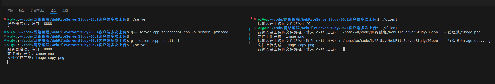

# 
现在已经实现一个能够上传文件的服务器了。

# 问题
目前客户端上传完后，就退出了，如果想让客户端在上传完后继续执行其他操作。
# 实现
目前你的客户端代码上传文件后就会直接 `close(sock)` 断开连接，服务端也会认为“传输结束”并关闭处理流程。

如果你希望客户端**连续上传多个文件（同一连接中）**，那你就需要：

---

## ✅ 实现目标：客户端可上传多个文件而不断开连接

### 🧠 实现方式

* **客户端**：

  * 支持循环输入文件路径。
  * 每次上传一个文件：发送 `"UPLOAD filename\n"` + 内容。
  * 继续下一个上传直到用户退出。
* **服务端**：

  * 修改逻辑：**循环读取多个上传命令**。
  * 每次接收 `"UPLOAD filename\n"` + 内容，直到下一个命令或连接断开。

这样就能够实现文件的上传了。

