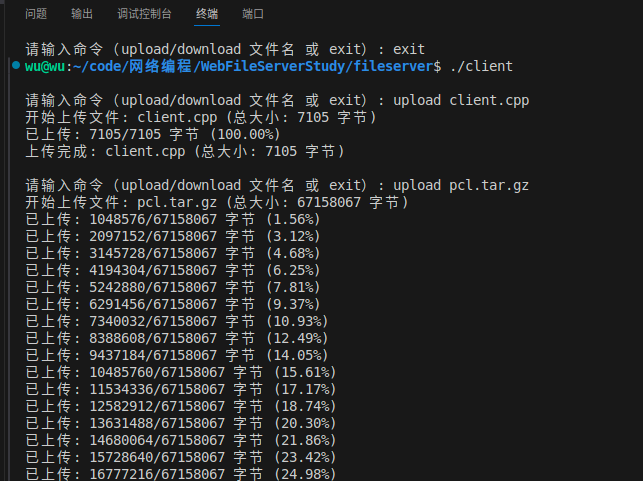

# 文件传输服务器

这是一个基于C++实现的高性能文件传输服务器系统，支持文件的上传和下载功能。系统采用多线程设计，使用线程池和epoll机制来处理并发连接。

## 系统架构

- 服务端：使用epoll实现高性能I/O多路复用
- 客户端：支持命令行交互式操作
- 传输协议：基于TCP的自定义应用层协议
- 并发处理：采用线程池技术

## 功能特点

- 支持文件上传和下载
- 实时显示传输进度



- 支持大文件传输
- 自动处理文件名冲突
- 支持断开连接自动清理
- 二进制传输模式，保证文件完整性

## 使用方法

### 编译

在项目根目录下执行：
```bash
make
```

### 启动服务器

```bash
./server
```

服务器默认监听8888端口。

### 客户端操作

启动客户端：
```bash
./client
```

支持的命令：

1. 上传文件
```bash
upload 文件名
```
将本地文件上传到服务器的filedir目录下

2. 下载文件
```bash
download 文件名
```
从服务器的filedir目录下载文件到当前目录

3. 退出程序
```bash
exit
```

## 项目结构

- `server.cpp`: 服务器端主程序
- `client.cpp`: 客户端程序
- `threadpool.h`: 线程池头文件
- `threadpool.cpp`: 线程池实现
- `makefile`: 编译配置文件
- `filedir/`: 服务器端文件存储目录

## 注意事项

1. 确保服务器上的filedir目录存在且有正确的读写权限
2. 大文件传输时请保持网络连接稳定
3. 文件名不要包含特殊字符
4. 支持相对路径和绝对路径上传文件

## 技术特点

- 使用C++11标准
- 基于epoll的事件驱动模型
- 自定义线程池实现并发处理
- 非阻塞I/O操作
- 二进制文件传输支持
- 实时进度显示功能


        